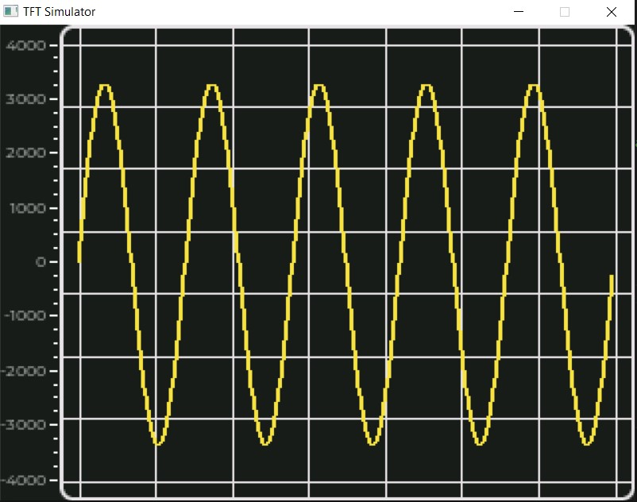

# esp32_oscilloscope

## About this project
Simple oscilloscope built on ESP-IDF framework. The board it uses it's ESP-WROVER-KIT V4.1 because it's single dev board that has all needed features: 

 - LCD screen
 - FT2232HL chip that can be used for debugging
 - 5V Power Input

Of course this project is nowhere real oscilloscope, and ADC in ESP32 is not so good. This was made purely for educational purposes. 
#### Example:

## Documentation
### PlatformIO:

 - [PlatformIO documentation](https://docs.platformio.org/en/latest/what-is-platformio.html)
 - [PlatformIO about ESP-IDF](https://docs.platformio.org/en/latest/frameworks/espidf.html)

### ESP-IDF:

 - [ESP-IDF documentation](https://docs.espressif.com/projects/esp-idf/en/latest/esp32/index.html)
 - [ESP-WROVER-KIT hardware description](https://docs.espressif.com/projects/esp-idf/en/latest/esp32/hw-reference/esp32/get-started-wrover-kit.html)

### Folder specific README files:

 - [Tests README](https://github.com/Nietaktowny/esp32_oscilloscope/blob/main/test/README)
 - [Libraries README](https://github.com/Nietaktowny/esp32_oscilloscope/blob/main/lib/README)
 
### Getting started
 1. Install PlatformIO:
	 

          python -m pip install --upgrade pip
          pip install -U platformio
          platformio update

2. Install needed dependencies like SDL2:
	- Linux:
	

          sudo apt-get update
          sudo apt-get install libsdl2-dev
	- macOS:
	

    ``HOMEBREW_NO_AUTO_UPDATE=1 brew install sdl2``

	- Windows:
	Activate msys2 and mingw64:
	``echo "C:\msys64\usr\bin" >> $env:GITHUB_PATH
	echo "C:\msys64\mingw64\bin" >> $env:GITHUB_PATH``
	Install deps:
	``pacman --noconfirm -S --needed mingw-w64-x86_64-SDL2
	gcc --version``
3. Build this project with PlatformIO:
	- for embedded:
``platformio run -e esp32_release``
	- for native emulator:
	``platformio run -e native_sdl``
4. Run this project:
	- flash it on ESP-WROVER-KIT:
	``pio run -t upload -t monitor -e esp32_release``
	- run it on native platform with emulator:
	``pio run -t execute -e native_sdl``
	`
## Problems
-[] Reduce delay between reading and drawing values.
